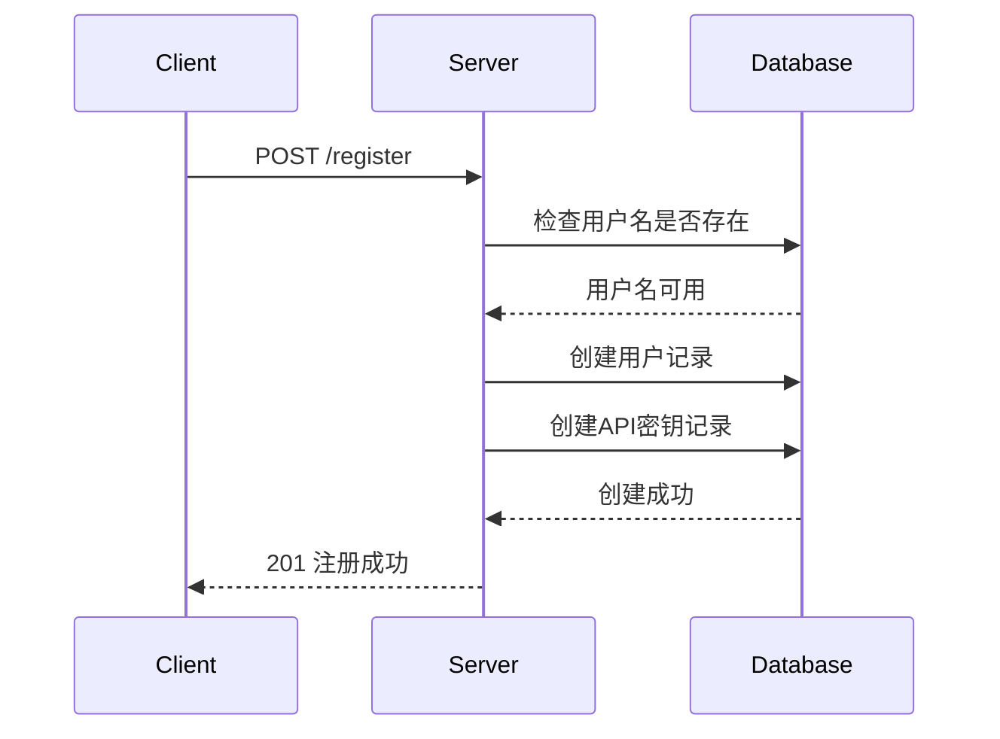
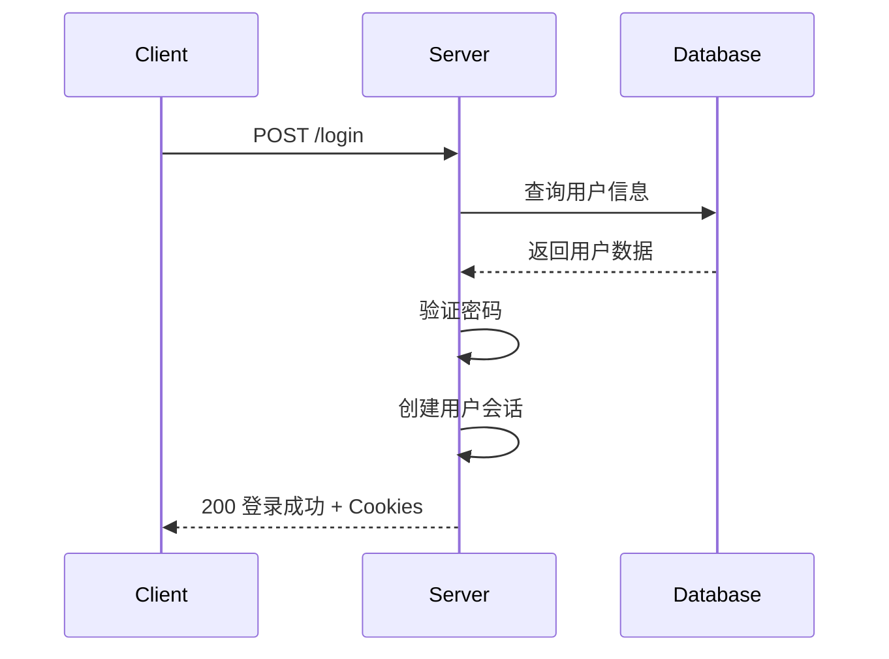
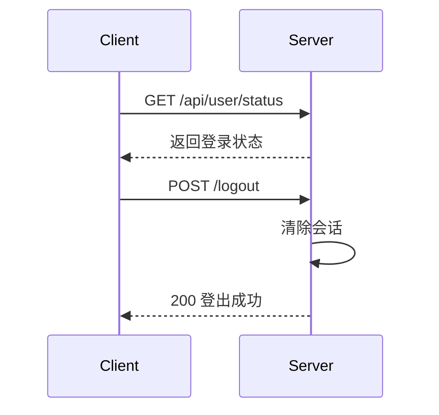

# 用户认证API使用说明

## 概述

本项目已成功集成了完整的用户认证系统，包括用户注册、登录、登出和状态检查功能。所有API都基于Flask-Login框架实现，提供安全的会话管理。

## API接口列表

### 1. 用户注册
- **URL**: `/register`
- **方法**: `POST`
- **描述**: 创建新用户账户
- **认证**: 无需认证

#### 请求参数
```json
{
    "username": "用户名",
    "password": "密码"
}
```

#### 响应示例
**成功 (201 Created)**:
```json
{
    "message": "注册成功"
}
```

**失败 (400 Bad Request)**:
```json
{
    "error": "用户名和密码不能为空"
}
```

**失败 (409 Conflict)**:
```json
{
    "error": "用户名已存在"
}
```

### 2. 用户登录
- **URL**: `/login`
- **方法**: `POST`
- **描述**: 用户身份验证并创建会话
- **认证**: 无需认证

#### 请求参数
```json
{
    "username": "用户名",
    "password": "密码"
}
```

#### 响应示例
**成功 (200 OK)**:
```json
{
    "message": "登录成功"
}
```

**失败 (400 Bad Request)**:
```json
{
    "error": "用户名和密码不能为空"
}
```

**失败 (401 Unauthorized)**:
```json
{
    "error": "用户名或密码无效"
}
```

### 3. 用户登出
- **URL**: `/logout`
- **方法**: `POST`
- **描述**: 结束当前用户会话
- **认证**: 需要登录

#### 请求参数
无

#### 响应示例
**成功 (200 OK)**:
```json
{
    "message": "登出成功"
}
```

**失败 (401 Unauthorized)**:
```json
{
    "error": "请先登录"
}
```

### 4. 用户状态检查
- **URL**: `/api/user/status`
- **方法**: `GET`
- **描述**: 检查当前用户登录状态
- **认证**: 无需认证

#### 请求参数
无

#### 响应示例
**已登录 (200 OK)**:
```json
{
    "isLoggedIn": true,
    "user": {
        "username": "当前用户名"
    }
}
```

**未登录 (200 OK)**:
```json
{
    "isLoggedIn": false
}
```

## 使用流程

### 1. 用户注册流程


### 2. 用户登录流程


### 3. 会话管理流程


## 安全特性

### 1. 密码安全
- 使用Werkzeug的`generate_password_hash`进行密码加密
- 密码以哈希形式存储在数据库中
- 支持密码强度验证（可在后续版本中添加）

### 2. 会话安全
- 基于Flask-Login的安全会话管理
- 自动生成安全的会话ID
- 支持会话过期和清理

### 3. 数据验证
- 输入参数完整性检查
- 用户名唯一性验证
- 适当的HTTP状态码返回

## 错误处理

### 1. 常见错误码
- **400**: 请求参数错误
- **401**: 未授权访问
- **409**: 资源冲突（如用户名已存在）
- **500**: 服务器内部错误

### 2. 错误响应格式
```json
{
    "error": "错误描述信息"
}
```

## 测试方法

### 1. 使用测试脚本
```bash
# 确保应用正在运行
python app.py

# 在另一个终端运行测试
python test_auth_api.py
```

### 2. 使用curl命令
```bash
# 注册用户
curl -X POST http://localhost:5000/register \
  -H "Content-Type: application/json" \
  -d '{"username":"testuser","password":"testpass"}'

# 用户登录
curl -X POST http://localhost:5000/login \
  -H "Content-Type: application/json" \
  -d '{"username":"testuser","password":"testpass"}' \
  -c cookies.txt

# 检查状态
curl -X GET http://localhost:5000/api/user/status \
  -b cookies.txt

# 用户登出
curl -X POST http://localhost:5000/logout \
  -b cookies.txt
```

### 3. 使用Postman或其他API测试工具
- 导入API接口定义
- 设置请求参数和头信息
- 执行测试并验证响应

## 前端集成

### 1. 注册表单
```javascript
async function register(username, password) {
    try {
        const response = await fetch('/register', {
            method: 'POST',
            headers: {
                'Content-Type': 'application/json'
            },
            body: JSON.stringify({ username, password })
        });
        
        const data = await response.json();
        if (response.ok) {
            console.log('注册成功:', data.message);
        } else {
            console.error('注册失败:', data.error);
        }
    } catch (error) {
        console.error('请求错误:', error);
    }
}
```

### 2. 登录表单
```javascript
async function login(username, password) {
    try {
        const response = await fetch('/login', {
            method: 'POST',
            headers: {
                'Content-Type': 'application/json'
            },
            body: JSON.stringify({ username, password })
        });
        
        const data = await response.json();
        if (response.ok) {
            console.log('登录成功:', data.message);
            // 登录成功后可以重定向或更新UI
        } else {
            console.error('登录失败:', data.error);
        }
    } catch (error) {
        console.error('请求错误:', error);
    }
}
```

### 3. 状态检查
```javascript
async function checkUserStatus() {
    try {
        const response = await fetch('/api/user/status');
        const data = await response.json();
        
        if (data.isLoggedIn) {
            console.log('用户已登录:', data.user.username);
            // 显示用户信息或受保护的内容
        } else {
            console.log('用户未登录');
            // 显示登录表单或提示信息
        }
    } catch (error) {
        console.error('状态检查错误:', error);
    }
}
```

## 注意事项

### 1. 开发环境
- 确保数据库已正确初始化
- 检查所有依赖包已安装
- 验证Flask应用配置正确

### 2. 生产环境
- 更改默认的SECRET_KEY
- 使用HTTPS协议
- 配置适当的会话超时时间
- 实现密码强度要求
- 添加登录尝试限制

### 3. 扩展功能
- 用户角色和权限管理
- 密码重置功能
- 邮箱验证
- 双因素认证
- 登录日志记录

## 故障排除

### 1. 常见问题
- **数据库连接错误**: 检查数据库文件权限和路径
- **导入错误**: 确保所有依赖包已安装
- **会话问题**: 检查SECRET_KEY配置
- **CORS错误**: 验证前端域名配置

### 2. 调试方法
- 查看Flask应用日志
- 使用Flask调试模式
- 检查数据库表结构
- 验证API请求和响应

## 版本历史

- **v1.0**: 基础用户认证功能
  - 用户注册、登录、登出
  - 会话状态管理
  - 基本安全特性

## 下一步开发

1. **用户管理API**: 用户信息更新、删除
2. **权限系统**: 角色基础访问控制
3. **密码管理**: 密码重置、强度验证
4. **安全增强**: 登录尝试限制、IP白名单
5. **审计日志**: 用户操作记录
6. **API密钥管理**: 用户专属API密钥配置
