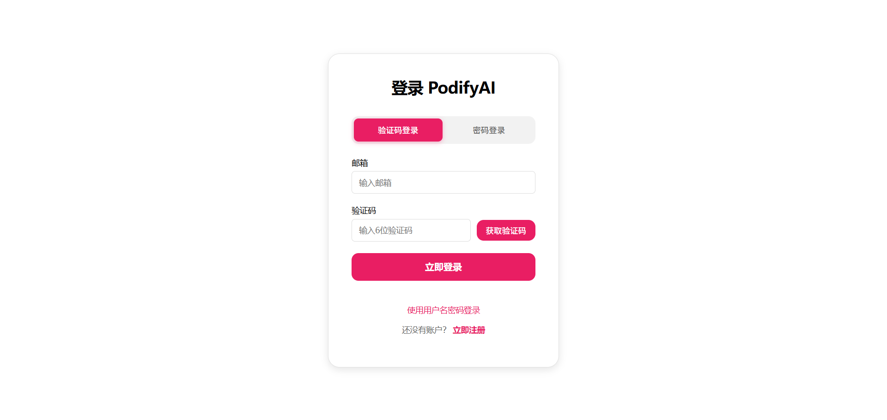
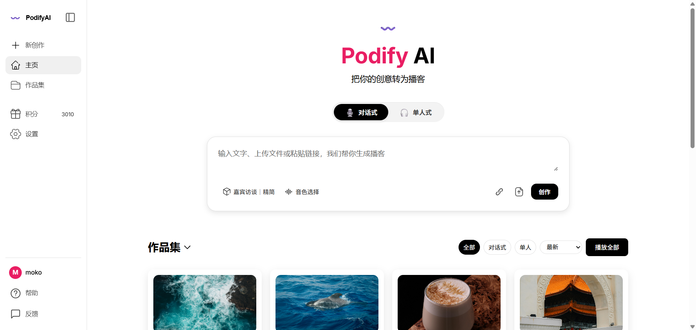

# PodifyAI Local Demo

PodifyAI does not currently have a public hosted demo. This page documents the local product flow with screenshots from a local run.

## Login

Users can log in with OTP or password-based authentication.

## Main workflow

After login, users can start a new podcast creation flow from text, uploaded files, or pasted links. The current UI supports dialogue-style and single-speaker podcast generation, voice selection, work history, credits, and account settings.

## Notes

- These screenshots are from a local or limited test environment.
- They do not represent a public production deployment.
- No private user data, API keys, or service credentials are included.
