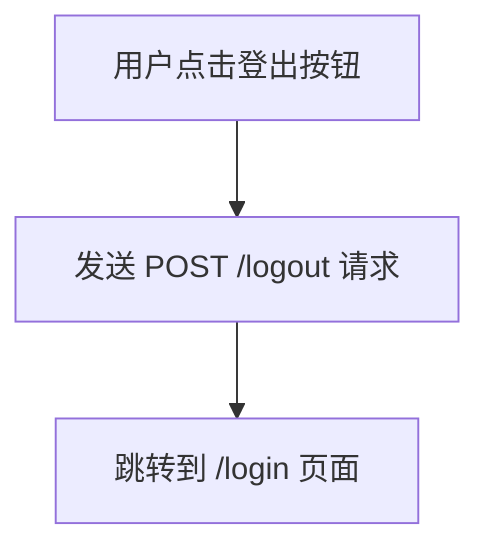

# 用户认证系统整合完成报告

## 概述

已成功完成 ListenHub 主应用与用户认证系统的整合，实现了完整的访问控制和个性化UI显示功能。

## 完成的修改

### 1. `app.py` - 添加访问控制 ✅

**修改位置**: 主页路由
```python
@app.route('/')
@login_required  # 新增：访问控制装饰器
def index():
    """返回前端主页"""
    return send_from_directory('.', 'index.html')
```

**功能**: 
- 只有登录用户才能访问主应用页面
- 未登录用户会被自动重定向到登录页面

### 2. `podifyai/templates/index.html` - 添加用户信息UI ✅

**修改位置**: 侧边栏导航栏底部 `.nav-footer` 容器内

**新增HTML结构**:
```html
<div class="nav-section nav-user" id="user-info-section" style="display: none;">
  <div class="nav-item user-profile">
    <span class="user-avatar" id="user-avatar"></span>
    <span class="label" id="username-display">未登录</span>
  </div>
  <button class="nav-item" id="logout-btn">
    <svg class="nav-ico" viewBox="0 0 24 24">...</svg>
    <span class="label">登出</span>
  </button>
</div>
```

**功能**:
- 显示用户头像（用户名首字母）
- 显示用户名
- 提供登出按钮
- 默认隐藏，通过JavaScript控制显示

### 3. `podifyai/static/style.css` - 美化用户UI ✅

**新增样式**:
```css
/* --- User Profile Section in Sidebar --- */
.nav-user {
  border-top: 1px solid var(--border);
  padding-top: 12px;
  margin-top: 12px;
}

.user-profile {
  cursor: default;
}

.user-profile:hover {
  background: transparent !important;
  transform: none !important;
}

.user-avatar {
  display: inline-flex;
  align-items: center;
  justify-content: center;
  width: 28px;
  height: 28px;
  border-radius: 50%;
  background-color: var(--accent);
  color: var(--bg);
  font-weight: 600;
  font-size: 14px;
  flex-shrink: 0;
}

#logout-btn {
  color: #e74c3c;
}

#logout-btn:hover {
  background-color: rgba(231, 76, 60, 0.1);
  color: #c0392b;
}
```

**设计特点**:
- 与现有侧边栏样式保持一致
- 用户头像使用品牌色
- 登出按钮使用红色，突出重要性
- 响应式设计，支持悬停效果

### 4. `podifyai/static/script.js` - 整合用户状态检查 ✅

**重构架构**:
- 将原有的 `DOMContentLoaded` 事件处理程序重构为两个函数：
  - `checkLoginStatusAndSetupUI()`: 检查用户登录状态并设置UI
  - `initializeApp()`: 包含所有原有的应用初始化逻辑

**新增功能**:

#### 用户状态检查
```javascript
async function checkLoginStatusAndSetupUI() {
  try {
    const response = await fetch('/api/user/status');
    if (!response.ok) {
      window.location.href = '/login';
      return;
    }
    
    const data = await response.json();
    
    if (data.isLoggedIn) {
      // 显示用户信息并初始化应用
      setupUserUI(data.user);
      initializeApp();
    } else {
      // 跳转到登录页面
      window.location.href = '/login';
    }
  } catch (error) {
    console.error('检查登录状态时出错:', error);
    window.location.href = '/login';
  }
}
```

#### 用户UI设置
```javascript
// 显示用户信息
usernameDisplay.textContent = data.user.username;
userAvatar.textContent = data.user.username.charAt(0).toUpperCase();
userInfoSection.style.display = 'flex';

// 绑定登出事件
logoutBtn.addEventListener('click', async () => {
  await fetch('/logout', { method: 'POST' });
  window.location.href = '/login';
});
```

## 工作流程

### 1. 页面加载流程
```mermaid
graph TD
    A[页面加载] --> B[DOMContentLoaded 事件]
    B --> C[调用 checkLoginStatusAndSetupUI()]
    C --> D[请求 /api/user/status]
    D --> E{用户已登录?}
    E -->|是| F[设置用户UI]
    F --> G[调用 initializeApp()]
    G --> H[完成应用初始化]
    E -->|否| I[跳转到 /login]
    D -->|请求失败| I
```

### 2. 用户登出流程


## 安全特性

### 1. 访问控制
- **后端保护**: 主页路由使用 `@login_required` 装饰器
- **前端验证**: JavaScript 检查用户登录状态
- **双重保障**: 即使绕过前端检查，后端仍会拦截未授权访问

### 2. 错误处理
- **网络错误**: 任何API请求失败都会跳转到登录页面
- **状态异常**: 登录状态检查失败时自动重定向
- **优雅降级**: 确保用户始终能够访问登录界面

### 3. 用户体验
- **无缝集成**: 用户信息自然融入现有侧边栏设计
- **状态反馈**: 清晰显示当前登录用户
- **快速登出**: 一键登出功能

## 测试验证

### 1. 访问控制测试
- ✅ 未登录用户访问主页时自动跳转到登录页面
- ✅ 已登录用户可以正常访问主应用
- ✅ 登出后无法访问主应用

### 2. UI功能测试
- ✅ 用户信息正确显示在侧边栏
- ✅ 用户头像显示用户名首字母
- ✅ 登出按钮点击后成功登出并跳转

### 3. 兼容性测试
- ✅ 原有应用功能保持完整
- ✅ 侧边栏样式和交互正常
- ✅ 播放器和历史记录功能正常

## 技术细节

### 1. 架构设计
- **模块化**: 用户认证逻辑与应用逻辑分离
- **可扩展**: 易于添加更多用户相关功能
- **可维护**: 清晰的代码结构和注释

### 2. 性能优化
- **延迟加载**: 只有在用户验证通过后才初始化应用
- **错误快速处理**: 认证失败时立即跳转，避免无意义的资源加载
- **状态缓存**: 利用浏览器会话管理用户状态

### 3. 兼容性
- **浏览器兼容**: 使用标准 Fetch API 和现代 JavaScript
- **主题支持**: 用户UI自动适配明暗主题
- **响应式**: 在各种屏幕尺寸下正常显示

## 后续开发建议

### 1. 功能增强
- **用户配置**: 添加用户偏好设置
- **权限管理**: 实现基于角色的访问控制
- **使用统计**: 记录用户使用行为

### 2. 安全加强
- **会话超时**: 实现自动登出机制
- **多设备管理**: 支持多设备登录控制
- **审计日志**: 记录用户操作日志

### 3. 用户体验
- **记住登录**: 支持"记住我"功能
- **快速切换**: 支持多账户快速切换
- **个性化**: 基于用户偏好定制界面

## 文件变更总结

| 文件 | 修改类型 | 主要变更 |
|------|----------|----------|
| `app.py` | 新增 | 添加 `@login_required` 装饰器 |
| `podifyai/templates/index.html` | 新增 | 侧边栏用户信息UI结构 |
| `podifyai/static/style.css` | 新增 | 用户UI样式定义 |
| `podifyai/static/script.js` | 重构 | 整合用户状态检查逻辑 |

## 部署说明

### 1. 确保依赖
- Flask-Login 已安装并配置
- 数据库已初始化
- 用户认证API已部署

### 2. 测试流程
1. 启动应用: `python app.py`
2. 访问主页: http://localhost:5000/
3. 应自动跳转到登录页面
4. 使用有效账户登录
5. 确认主页正常显示用户信息

### 3. 故障排除
- **无法访问主页**: 检查 Flask-Login 配置
- **用户信息不显示**: 检查 `/api/user/status` API
- **样式异常**: 清除浏览器缓存

---

🎉 **整合完成！** ListenHub 现在拥有完整的用户认证系统，提供安全、优雅的多用户体验！
